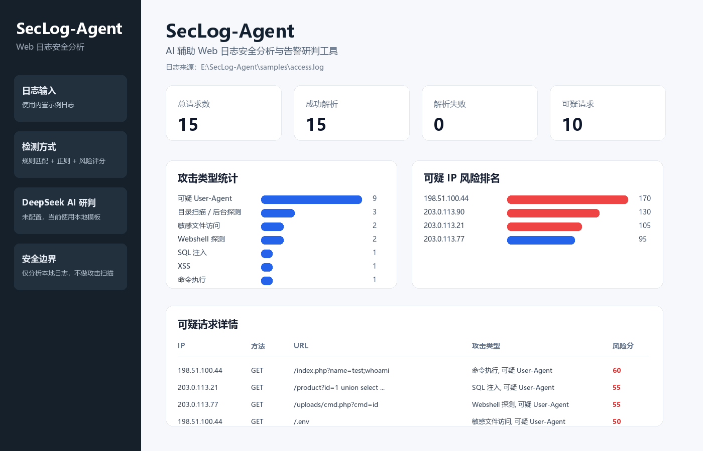

# SecLog-Agent

SecLog-Agent 是一个面向安全运营、SOC、蓝队值守和应急响应场景的 AI 辅助 Web 日志安全分析工具。项目只对本地 Nginx / Apache `access.log` 进行解析、攻击特征识别、风险评分、可疑 IP 排名和报告生成，不包含扫描真实网站、爆破、漏洞利用或 getshell 等攻击功能。



## 功能

- 上传或读取 Nginx / Apache `access.log`
- 解析 IP、时间、请求方法、URL、HTTP 状态码、响应大小、Referer、User-Agent
- 统计总请求数、成功解析数、可疑请求数、访问次数 Top IP、状态码和 User-Agent
- 识别 SQL 注入、XSS、命令执行、敏感文件访问、目录扫描 / 后台探测、Webshell 探测、可疑 User-Agent
- 根据命中规则和命中次数计算风险分，输出高危 / 中危 / 低危 IP
- 使用 Streamlit 展示指标卡、图表、可疑 IP 排名和可疑请求详情
- 支持 DeepSeek AI 研判报告；未配置 API Key 时自动回退到本地模板报告
- 支持导出 Markdown 报告到 `reports/security_report.md`

## 项目结构

```text
SecLog-Agent/
├── app.py                  # Streamlit 页面入口
├── log_parser.py           # 日志解析模块
├── detector.py             # 攻击检测模块
├── risk_score.py           # 风险评分模块
├── ai_reporter.py          # DeepSeek / 模板研判报告模块
├── report_generator.py     # Markdown 报告生成模块
├── rules.yaml              # 检测规则配置
├── requirements.txt        # Python 依赖
├── README.md               # 项目说明
├── samples/
│   └── access.log          # 示例日志
├── reports/
│   └── security_report.md  # 示例报告 / 导出报告
└── screenshots/
    └── dashboard.png       # 项目截图
```

## 安装

```bash
pip install -r requirements.txt
```

## 运行

```bash
streamlit run app.py
```

启动后访问 Streamlit 页面，默认会使用 `samples/access.log` 进行演示，也可以上传自己的 access.log 文件。

## DeepSeek 配置（或其他ai）

程序会从环境变量 `DEEPSEEK_API_KEY` 读取 DeepSeek API Key。

Windows PowerShell 示例：

```powershell
$env:DEEPSEEK_API_KEY="你的 DeepSeek API Key"
streamlit run app.py
```

如果没有配置 `DEEPSEEK_API_KEY`，系统会自动使用本地模板生成 AI 风格研判报告。

## 检测规则

检测规则集中放在 `rules.yaml` 中，每条规则包含规则名称、攻击类型、风险分、匹配字段和正则表达式。扩展新检测能力时，可以优先修改 `rules.yaml`，不需要改动主程序。

当前内置检测类型：

- SQL 注入
- XSS
- 命令执行
- 敏感文件访问
- 目录扫描 / 后台探测
- Webshell 探测
- 可疑 User-Agent

## 报告输出

点击页面中的“保存 Markdown 报告”后，报告会写入：

```text
reports/security_report.md
```

报告包含分析概况、攻击类型统计、可疑 IP 风险排名、关键可疑请求证据、AI 研判总结、应急排查建议和安全加固建议。

## 合规说明

SecLog-Agent 是蓝队日志分析与应急响应辅助工具，只处理本地日志文件，不提供自动化攻击、扫描真实目标、爆破、漏洞利用或 getshell 功能。
